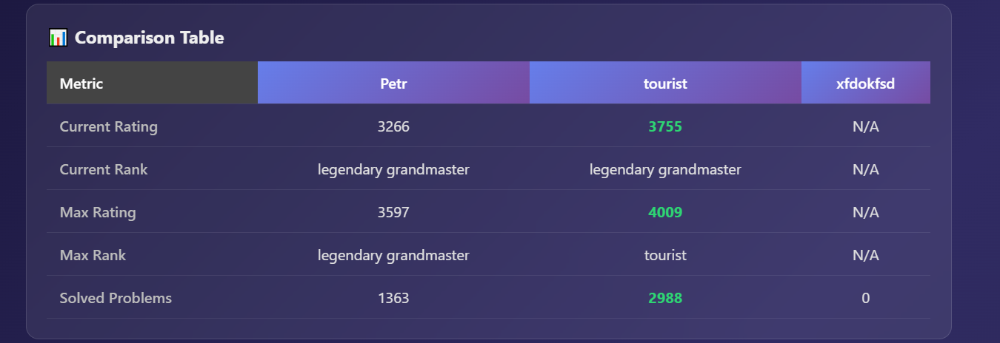
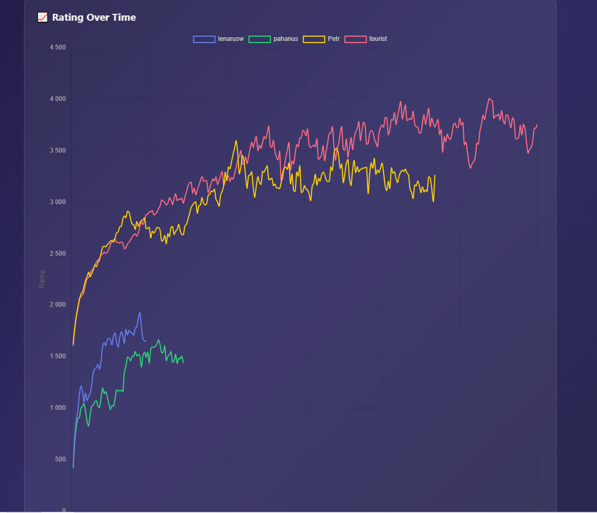

# CF Compare

A web application for comparing competitive programmers on Codeforces with real-time analytics and persistent comparison history.

## 📸 Demo

**Comparison Table** — Compare up to 5 users side by side with ratings, ranks, and solved problem counts:



**Rating History Chart** — Visualize rating progress over time with interactive line charts:



## 👥 End Users

- **Competitive programming coaches** who want to compare their students' progress
- **Codeforces participants** looking to benchmark themselves against peers or idols
- **Programming club organizers** who need to track team performance over time
- **Aspiring contestants** who want to identify strengths and weaknesses compared to higher-rated users

## ❌ Problem

Competitive programmers on Codeforces often want to understand how they stack up against others, but:

- **No side-by-side comparison** — Codeforces shows individual profiles, making it hard to compare multiple users at once
- **Lost context** — Every comparison is manual; you can't revisit past comparisons or track trends
- **No actionable insights** — Raw numbers don't tell you *what* to improve or *where* you're weaker
- **Scattered data** — Rating history, problem tags, and solved counts require navigating multiple pages

## ✅ Solution

CF Compare provides:

1. **Instant multi-user comparison** — Enter 2-5 Codeforces handles and see all key metrics in one table
2. **Visual analytics** — Interactive charts for rating history and problem-solving patterns by tag
3. **Persistent history** — All comparisons are saved and tied to your account for future reference
4. **Placeholder insights** — Template-based recommendations based on strengths and weaknesses
5. **Head-to-head analysis** — See how two users perform when compared against each other over time

## ✨ Features

### ✅ Implemented

| Feature | Description |
|---------|-------------|
| **User Authentication** | Registration, login, JWT-based sessions with auto-login |
| **Multi-User Comparison** | Compare 2-5 Codeforces handles simultaneously |
| **Detailed Statistics** | Current/max rating, rank, solved problem count |
| **Rating History Charts** | Interactive line charts showing rating progression |
| **Tag Analysis** | Horizontal bar charts showing strongest problem categories |
| **Comparison History** | View and reload all your past comparisons |
| **Insights (placeholder)** | Template-based recommendations from stats |
| **Caching** | 10-minute DB cache to reduce API calls |
| **Leaderboard** | Global ranking of most-compared handles by best rating |
| **Most Improved** | Find users with the largest rating improvement over time |
| **Head-to-Head** | Direct matchup history between two specific users |
| **Rating Progress** | Track how a single user's stored rating changed across comparisons |
| **Activity Dashboard** | Daily comparison frequency visualization |
| **Dockerized Deployment** | One-command deploy with PostgreSQL + FastAPI + Nginx |

### 🚧 Not Yet Implemented

| Feature | Description |
|---------|-------------|
| **User Profiles** | Custom avatars, bios, and followed users |
| **Export to PDF/CSV** | Download comparison results as a file |
| **Public Comparisons** | Share a link to a comparison without requiring login |
| **Real-Time Notifications** | Alerts when a tracked user's rating changes |
| **Team Management** | Group users into teams for bulk comparison |
| **Advanced Filtering** | Filter history by date range, tags, or rating range |
| **Mobile App** | Native iOS/Android application |
| **Multi-language Support** | i18n for non-English speakers |

## 🚀 Usage

### 1. Open the Application

Navigate to `http://185.5.75.198:3000` in your browser.

### 2. Register or Login

- Click **"Register"** to create a new account (username ≥ 3 chars, password ≥ 4 chars)
- Or click **"Login"** with existing credentials
- Your session persists via JWT in `localStorage`

### 3. Compare Users

- Go to the **Compare** tab
- Enter 2-5 Codeforces handles separated by commas (e.g., `tourist, petr, benq`)
- Click **"Compare"**
- Results show a comparison table, rating chart, and tag charts

### 4. View Insights

- After a comparison, click **"Generate Insight"** to see placeholder recommendations
- Insights display top tags, solved counts, and rating gaps

### 5. Browse History

- Switch to the **History** tab to see all your past comparisons
- Click **"Load"** on any entry to re-view it

### 6. Explore Stats

- **Leaderboard** — See the most-compared users by best rating
- **Most Improved** — Find users with the largest rating growth
- **Head-to-Head** — Enter two handles to see their direct matchup record
- **Rating Progress** — Track a single user's rating across all your comparisons
- **Activity** — View your daily comparison frequency

Swagger UI available at `http://185.5.75.198:8000/docs`.

## 🛠️ Deployment

### Prerequisites

The VM needs the following software:

- **Docker** — Container runtime
- **Docker Compose V2** — Orchestration (ships with Docker as a plugin)

Nothing else needs to be installed — PostgreSQL, Python, Nginx, and all dependencies run inside containers.

### Step-by-Step Instructions

#### Step 1: Install Docker

```bash
curl -fsSL https://get.docker.com -o get-docker.sh
sudo sh get-docker.sh
sudo usermod -aG docker $USER

docker --version
docker compose version
```

#### Step 2: Clone the Project

```bash
git clone <repository-url>
cd se-toolkit-hackathon
```

#### Step 3: Configure Environment Variables

```bash
cp .env.example .env
nano .env
```

**Required variables:**

| Variable | Description | Example |
|----------|-------------|---------|
| `POSTGRES_USER` | Database username | `cfuser` |
| `POSTGRES_PASSWORD` | Database password | `cfpassword` |
| `POSTGRES_DB` | Database name | `cfcompare` |
| `API_KEY` | Codeforces API key (optional) | *(from codeforces.com/settings/api)* |
| `API_SECRET` | Codeforces API secret (optional) | *(from codeforces.com/settings/api)* |

**Optional variables:**

| Variable | Description | Example |
|----------|-------------|---------|
| `JWT_SECRET` | Secret for JWT signing | `my-secret-key` |
| `CACHE_TTL_SECONDS` | Cache duration | `600` |

#### Step 4: Build and Start

```bash
docker compose up --build -d
```

This launches three containers:
- **PostgreSQL** (`db`) — Database with auto-initialized schema
- **FastAPI** (`backend`) — Python API on port 8000
- **Nginx** (`frontend`) — Static frontend on port 3000

#### Step 5: Verify

```bash
docker compose ps
curl http://localhost:8000/health
# Expected: {"status":"ok","version":"2.0.0"}
```

#### Step 6: Access the Application

- **Frontend**: http://localhost:3000
- **Backend API**: http://localhost:8000
- **Swagger UI**: http://localhost:8000/docs

#### Step 7: View Logs (Optional)

```bash
docker compose logs
docker compose logs -f backend
```

#### Step 8: Stop

```bash
# Stop containers (database preserved)
docker compose down

# Stop and remove all data
docker compose down -v
```
